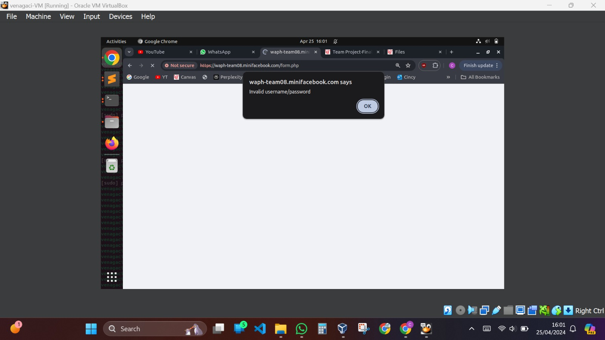

# WAPH-Web Application Programming and Hacking

## Instructor: Dr. Phu Phung

# Mini Facebook Application


# Team members

1. Venaganti Charan Sai , venagaci@mail.uc.edu
2. Sai Abhishek Avusula , avusulsk@mail.uc.edu
3. Ramya Padidala , padidara@mail.uc.edu
4. Varsha Thalishetti , thalisva@mail.uc.edu

# Project Management Information

Video Demonstration : https://mailuc-my.sharepoint.com/:v:/g/personal/venagaci_mail_uc_edu/EeK2LIQuhVZInxubnqGotwQB2bSSInFn8aMCuhCCViR-Tg?e=gSyoEJ
## ( PLEASE CONSIDER ABOVE VIDEO LINK FOR GRADING.THIS VIDEO DEMONSTRATION HAS CHATTING SYSTEM )

Source code repository (private access): <https://github.com/waph-team08/waph-teamproject>

Project homepage (public): <https://github.com/waph-team08/waph-team08.github.io>

## Revision History

| Date       |   Version     |                    Description                                       |
|------------|:-------------:|---------------------------------------------------------------------:|
| 04/16/2024 |  0.4          |              developed the mini facebook                             |


# Overview

This WAPH Team Project presents an immersive opportunity for us to delve into the intricacies of full-stack web development, fortified with a robust understanding of secure programming principles and agile methodologies. Through the lens of developing a miniFacebook web application, our team is primed to navigate the multifaceted landscape of modern web development, embracing iterative cycles termed Sprints under the guise of Scrum practices. Each milestone achieved within these cycles underscores the collaborative effort of team members, with contributions meticulously documented through code commits and comprehensive documentation within the shared repository. Upholding a meritocratic grading system, individual performance is meticulously evaluated, emphasizing not only the breadth but the quality of each team member's input. Effective communication is heralded as the linchpin of project success, prompting teams to harness dedicated channels like Microsoft Teams and convene regular meetings for strategic planning and synchronized progress tracking. With a gamut of functional requirements spanning user registration, login, and content management to real-time chat capabilities, coupled with stringent security protocols mandating HTTPS deployment, password hashing, and role-based access control, the project epitomizes a holistic journey into the realms of secure, scalable, and user-centric web application development.

## User Interface

# Implementation

Our WAPH Team Project crafts a miniFacebook web app, blending full-stack web dev, secure programming, and agile methods. Teams sculpt databases, code PHP backends with security in mind, and design user-friendly interfaces. Real-time chat adds vibrancy. Rigorous testing ensures robustness. HTTPS deployment ensures security. Documentation fuels continuous improvement.


# Security analysis
**Prepared Statements:** Protect against SQL injection attacks by using prepared statements in database queries.

**CSRF Token Validation:** Prevent CSRF attacks by validating random tokens with each request.

**Password Hashing:** Securely store passwords with bcrypt hashing to prevent plaintext exposure.

**Session Management:** Ensure secure session handling with HTTPS, secure cookies, and session regeneration.

**Input Validation:** Validate and sanitize user input to prevent injection and XSS attacks.

# Video demonstration

Video link:<https://mailuc-my.sharepoint.com/:v:/g/personal/avusulsk_mail_uc_edu/EeJxpg5wgtVKi4YwkT9dBcUBkiGt97U8OD2IpPiTTdQASg?nav=eyJyZWZlcnJhbEluZm8iOnsicmVmZXJyYWxBcHAiOiJPbmVEcml2ZUZvckJ1c2luZXNzIiwicmVmZXJyYWxBcHBQbGF0Zm9ybSI6IldlYiIsInJlZmVycmFsTW9kZSI6InZpZXciLCJyZWZlcnJhbFZpZXciOiJNeUZpbGVzTGlua0NvcHkifX0&e=rqjSVK>


# Execution Screenshots

1. The system is deployed on HTTPS,below we have kept the certificate of this.


2. The passwords which are available in database are hashed inorder to protect them from external attacks.below we have kept the screenshot for not using the MYSQL root account used for the PHP code.


3. Prepared statements are used here inorder to mitigate security risks by separating SQL logic from user input, thus preventing SQL injection attacks.By optimizing query execution and reducing parsing overhead, prepared statements enhance the performance of database operations, especially in high transaction volume scenarios.By Implementing prepared statements improves code maintainability and readability by separating SQL logic from application code, facilitating easier development and maintenance of database-driven applications.


4. Our system implements rigorous input validation at every layer—HTML, PHP, and SQL. This ensures that only properly formatted and permissible input is accepted, reducing the risk of security vulnerabilities such as cross-site scripting (XSS) and SQL injection.


5. To prevent cross-site scripting (XSS) attacks, all HTML outputs are sanitized before being rendered to the user's browser. This process removes potentially malicious scripts or content, thereby safeguarding users from harmful exploits.


6. Registered users and super users are assigned distinct roles with specific privileges. Super users have elevated permissions, enabling them to access and manage administrative functions, while regular users have limited access tailored to their needs.



A regular user cannot edit/update posts of other users.
This is post created by the user Cherry so he can able to edit/delete the post.


This post is created by user Chris , so user cherry cannot edit/delete the post.


7. Our system employs robust session authentication mechanisms to verify user identities and prevent session hijacking attacks. By generating unique session identifiers and validating user credentials, we ensure secure user sessions throughout their interaction with the system.


8. Cross-Site Request Forgery (CSRF) protection mechanisms are implemented to prevent unauthorized actions initiated by malicious third-party websites. By generating and validating unique tokens for each user session, our system guards against CSRF attacks, maintaining the integrity of user interactions.


9. We have integrated an open-source front-end CSS template i.e., BOOTSTRAP framework into our system to enhance the user interface and user experience. This template provides pre-designed elements and styles, allowing for faster development and a more polished appearance for our application.


10. This is homepage of website of our team project i.e., mini facebook. the link for this also provided below.

Project homepage: <https://waph-team08.github.io/>

The result of our teamwork is presented on a specialized website for our project team, providing stakeholders and users with access to project documentation, features, and demonstrations. This promotes transparency and cultivates collaboration both within the team and with external parties.


## Scrum process

### Sprint 0

Duration: 19/03/2024-22/03/2024

#### Overall team Completed Tasks: 

1.  Create an organization  on GitHub with name ​waph-team08 

Added the other members and phung-waph as organization members​
2. Member contributions to the team organization: ​

* Created a private repository for the project, namely waph-teamproject​
* Created a public repository to host the team project website, namely, waph-team08.github.io​
* Checkedout the  waph-teamproject repository and added README.md template​
* Checkedout the waph-team08.github.io repository and added index.html template​
* Checkedout the waph-teamproject and waph-team08.github.io repositories, added/revised the code, README.md, and index.html files accordingly; committed/pushed the changes​
  
3. Created team SSL key/certificate  and setup HTTPS and team local domain name.​

4. Design and setup the team database 

5. Copy the code skeleton from Lab 3 to the team repository waph-teamproject, revise  the code based on Lab 4 requirements  test and committed the code together with README.md and index.html for Sprint 0 submission.

#### Contributions: 

1. Member 1, 6 commits, 1 hours, contributed in addnewuser.php,changepassword.php,changepasswordform.php
2. Member 2, 4 commits, 1 hours, contributed in database.php,form.php
3. Member 3, 2 commits, 0.5 hours, contributed in index.php
4. Member 4, 3 commits, 0.5 hours, contributed in session_auth.php

### Sprint 1

Duration: 03/25/2024-03/31/2024

#### Completed Tasks: 

1. User Registration and login
2. change password
3. edit profile
4. view posts

#### Contributions: 

1. Member 1, 4 commits, 1 hours, contributed in csrf errors
2. Member 2, 6 commits, 1 hours, contributed in email errors
3. Member 3, 4 commits, 1 hours, contributed in password changing
4. Member 4, 3 commits, 1 hours, contributed in sucess.php

The rest of the code is in this link:

https://github.com/waph-team08/waph-teamproject/tree/main/SPRINT1

### Sprint 2

Duration: 03/31/2024-04/16/2024

#### Completed Tasks: 

1. Logged-in users can add a new post, and add a comment on any post.
2. Logged-in users can edit (update, delete) their own posts.
3. A user cannot edit posts of other users change password.

#### Contributions: 

1. Member 1, 8 commits, 3 hours, contributed in view_posts.php, database-data.sql
2. Member 2, 7 commits, 1 hours, contributed in delete_post.php
3. Member 3, 6 commits, 1 hours, contributed in edit_post.php
4. Member 4, 5 commits, 1 hours, contributed in add_comment.php

The rest of the code is in this link:

https://github.com/waph-team08/waph-teamproject/tree/main/Sprint2

### Sprint 3 (Final)

Duration: 04/17/2024-04/25/2024

#### Completed Tasks: 

1. Developing the super user who can disable or enable an account in application.
2. A disabled account cannot login in the application.
3. Adding the Chat system in the application.

#### Contributions: 

1. Member 1, 40 commits, 7 hours, contributed in chat.php,enable_disable_user.php,dashboard.php,database.php,
2. Member 2, 39 commits, 6 hours, contributed in db_config.php,get_messages.php, get_usernames.php,auth.php,db_connection.php
3. Member 3, 40 commits, 7 hours, contributed in populate_dropdown.php,style.css,index.php,script.js
4. Member 4, 38 commits, 6 hours, contributed in login.php,send_message.php,socketio-chatserver.js,client.html

# Appendix

enable_disable_user.php:

```php

<?php
session_start();

// Check if the user is logged in as a super user
if (!isset($_SESSION['super_user']) || $_SESSION['super_user'] !== true) {
    // If not, redirect to the login page
    header("Location: login.php");
    exit();
}

if ($_SERVER["REQUEST_METHOD"] == "POST" && isset($_POST["username"])
    && isset($_POST["action"])) {
    require_once "database.php";

    $username = $_POST["username"];
    $action = $_POST["action"];

    // Update user status based on the action
    if ($action === "enable") {
        $sql = "UPDATE users SET status = 1 WHERE username = ?";
    } elseif ($action === "disable") {
        $sql = "UPDATE users SET status = 0 WHERE username = ?";
    }

    $stmt = $mysqli->prepare($sql);
    $stmt->bind_param("s", $username);
    if ($stmt->execute()) {
        // Redirect back to dashboard after successful update
        header("Location: dashboard.php");
        exit();
    } else {
        echo "Error: " . $mysqli->error;
    }

    $stmt->close();
    $mysqli->close();
} else {
    // Redirect back to dashboard if accessed directly without
  POST request or missing parameters
    header("Location: dashboard.php");
    exit();
}
?>
  
```
dashboard.php:
```php
<?php
session_start();

// Check if the user is logged in as a super user
if (!isset($_SESSION['super_user']) || $_SESSION['super_user'] !== true) {
    // If not, redirect to the login page
    header("Location: login.php");
    exit();
}

require_once "database.php";

// Fetch all user details from the database
$sql = "SELECT * FROM users";
$result = $mysqli->query($sql);

?>

<!DOCTYPE html>
<html lang="en">
<head>
    <meta charset="UTF-8">
    <meta name="viewport" content="width=device-width, initial-scale=1.0">
    <title>Dashboard</title>
    <style>
        body {
            font-family: Arial, sans-serif;
            background-color: #f0f2f5;
            margin: 0;
            padding: 0;
            display: flex;
            justify-content: center;
            align-items: center;
            height: 100vh;
        }

        .container {
            background-color: #fff;
            border-radius: 20px;
            box-shadow: 0 2px 4px rgba(0, 0, 0, 0.1);
            padding: 30px;
            width: 600px;
            margin: auto;
            border: 3px solid #1877f2; /* Facebook blue color */
        }

        h1 {
            font-size: 24px;
            margin-bottom: 20px;
            text-align: center;
            color: #1877f2; /* Facebook blue color */
        }

        p {
            font-size: 16px;
            margin-bottom: 20px;
            color: #666;
        }

        table {
            width: 100%;
            border-collapse: collapse;
            margin-bottom: 20px;
        }

        th, td {
            border: 1px solid #ccc;
            padding: 8px;
            text-align: left;
        }

        th {
            background-color: #f2f2f2;
        }

        td button {
            background-color: #1877f2; /* Facebook blue color */
            color: #fff;
            font-size: 14px;
            cursor: pointer;
            border: none;
            border-radius: 5px;
            padding: 6px 12px;
        }

        td button:hover {
            background-color: #166fe5; /* Darker shade of Facebook blue color */
        }

        a {
            display: block;
            text-align: center;
            color: #1877f2; /* Facebook blue color */
            border: 1px solid #1877f2;
            border-radius: 5px;
            padding: 8px 16px;
            text-decoration: none;
            transition: background-color 0.3s, color 0.3s;
        }

        a:hover {
            background-color: #1877f2; /* Facebook blue color */
            color: #ffffff;
        }
    </style>
</head>
<body>
    <div class="container">
        <h1>Welcome, Super User!</h1>
        <p>This is your dashboard. Here, you can manage user details.</p>
        <?php if ($result->num_rows > 0) : ?>
            <table>
                <tr>
                    <th>Username</th>
                    <th>Email</th>
                    <th>Status</th>
                    <th>Action</th>
                </tr>
                <?php while ($row = $result->fetch_assoc()) : ?>
                    <tr>
                        <td><?php echo $row["username"]; ?></td>
                        <td><?php echo $row["email"]; ?></td>
                        <td><?php echo isset($row["status"]) ? ($row["status"]
                        ? "Enabled" : "Disabled") : "Unknown"; ?></td>
                        <td>
                            <?php if (isset($row["status"])) : ?>  
                                <form action="enable_disable_user.php" method="post">
                                    <input type="hidden" name="username" value="<?php echo                                                 $row["username"]; ?>">
                                    <input type="hidden" name="action" value="
                              <?php echo $row["status"] ? 'disable' : 'enable'; ?>">
                                    <button type="submit"><?php echo $row["status"] ? 'Disable' :                                         'Enable'; ?></button>
                                </form>
                            <?php else : ?>
                                Status unavailable
                            <?php endif; ?>
                        </td>
                    </tr>
                <?php endwhile; ?>
            </table>
        <?php else : ?>
            <p>No users found.</p>
        <?php endif; ?>
        <a href='logout.php'>Logout</a>
    </div>
</body>
</html>

```
chat.php:

```php

<!DOCTYPE html>
<html lang="en">
<head>
    <meta charset="UTF-8">
    <meta name="viewport" content="width=device-width, initial-scale=1.0">
    <title>Web Chat</title>
    <link rel="stylesheet" href="style.css">
</head>
<body>
    <div class="container">
        
        <div class="chat-area">
            <div class="chat-header">
                <h2>Web Chat</h2>
            </div>
            <div class="message-container">
                <!-- Messages will be displayed here -->
            </div>
            <form class="message-input" method="post" action="send_message.php">
                <input type="text" id="message" name="message" placeholder="Type a message...">
                <select id="receiver" name="receiver">
                    <!-- Dropdown options will be populated dynamically -->
                    
                </select>
                <button type="submit">Send</button>
            </form>
        </div>
        <form method="get" action="view_messages.php">
        <button id="view">View Messages</button>
        </form>
    </div>
    <script>
        // Function to fetch usernames and populate the dropdown menu
        function populateDropdown() {
            var xhr = new XMLHttpRequest();
            xhr.open('GET', 'get_usernames.php', true);
            xhr.onload = function () {
                if (xhr.status === 200) {
                    var usernames = JSON.parse(xhr.responseText);
                    var select = document.getElementById('receiver');
                    usernames.forEach(function (username) {
                        var option = document.createElement('option');
                        option.value = username;
                        option.textContent = username;
                        select.appendChild(option);
                    });
                }
            };
            xhr.send();
        }

        // Call the populateDropdown function when the page loads
        window.onload = function () {
            populateDropdown();
        };
    </script>
</body>
</html>

```

view_messages.php:

```php:
<?php
include('db_connection.php');

// Replace "receiver_username" with the actual method of retrieving the receiver's username
$receiver = "chris"; // Placeholder for receiver's username

// Prepare the query using a prepared statement
$query = "SELECT sender, message, sent_at FROM messages WHERE receiver = ?";
$stmt = mysqli_prepare($connection, $query);
mysqli_stmt_bind_param($stmt, "s", $receiver);
mysqli_stmt_execute($stmt);
$result = mysqli_stmt_get_result($stmt);

if ($result && mysqli_num_rows($result) > 0) {
    echo "<div class='message-container'>";
    while ($row = mysqli_fetch_assoc($result)) {
        echo "<div class='message'>";
        echo "<div class='sender'>" . htmlspecialchars($row['sender']) . "</div>";
        echo "<div class='content'>" . htmlspecialchars($row['message']) . "</div>";
        echo "<div class='time'>" . $row['sent_at'] . "</div>";
        echo "</div>";
    }
    echo "</div>";
} else {
    echo "<p>No messages received.</p>";
}
?>
<!DOCTYPE html>
<html lang="en">
<head>
    <meta charset="UTF-8">
    <meta name="viewport" content="width=device-width, initial-scale=1.0">
    <style>
        .message-container {
    max-width: 400px;
    margin: 20px auto;
}

.message {
    display: flex;
    align-items: center;
    background-color: #f0f2f5;
    border-radius: 10px;
    padding: 10px;
    margin-bottom: 10px;
}

.sender {
    font-weight: bold;
    color: #1877f2;
    margin-right: 10px;
}

.content {
    flex: 1;
    margin-right: 10px;
}

.time {
    font-size: 12px;
    color: #666;
}

    </style>    

</head>
<body>
   
    
</body>
</html>

```

db_connection.php:

```php
<?php
$servername = "localhost";
$username = "waph_team08";
$password = 'Pa$$w0rd';
$dbname = "waph_team";

// Create connection
$connection = mysqli_connect($servername, $username, $password, $dbname);

// Check connection
if (!$connection) {
    die("Connection failed: " . mysqli_connect_error());
}
?>

```

populate_dropdown.php:

```php
<?php
include('db_connection.php');

// Fetch usernames from the users table
$query = "SELECT username FROM users WHERE status = 1"; // Assuming status 1 means active users
$result = mysqli_query($connection, $query);

// Check if query was successful
if ($result) {
    // Iterate through each row and create an option for the dropdown menu
    while ($row = mysqli_fetch_assoc($result)) {
        echo "<option value='" . $row['username'] . "'>" . $row['username'] . "</option>";
    }
} else {
    // Handle error
    echo "<option value=''>Error: Unable to fetch users</option>";
}
?>

```


The rest of the code is in this link:

https://github.com/waph-team08/waph-teamproject/tree/main/Final_Project
